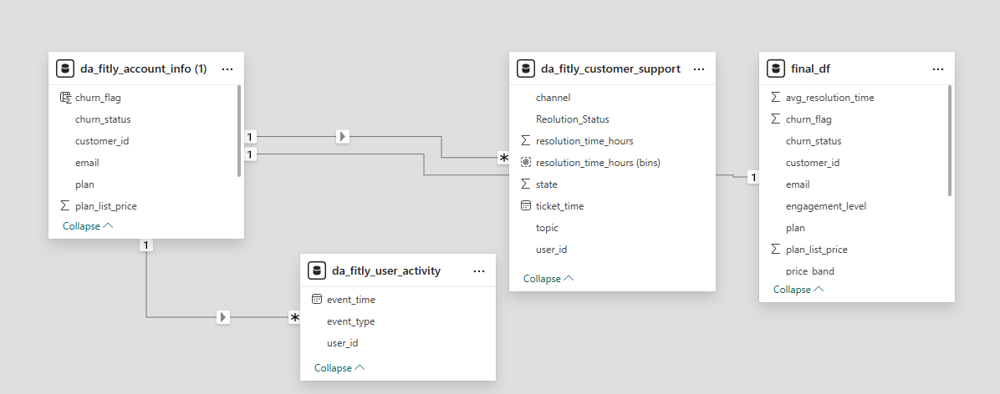
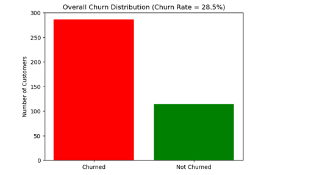
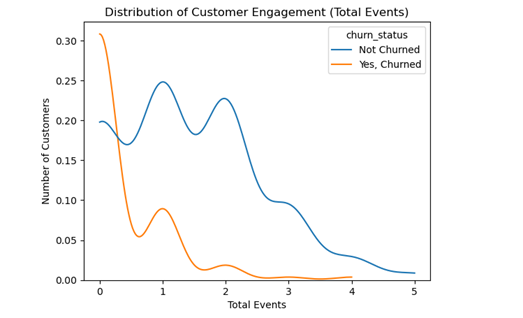
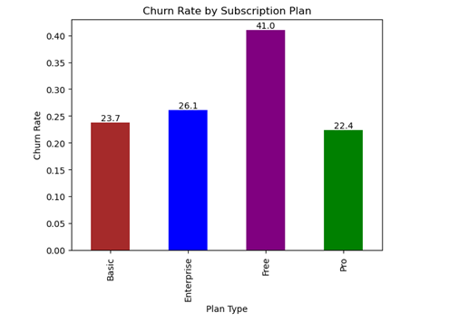
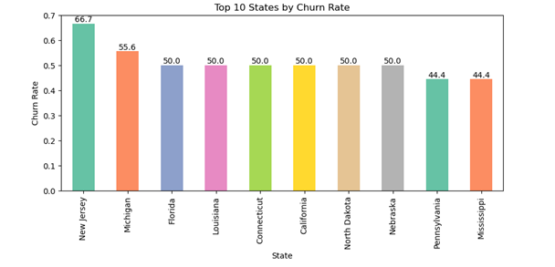
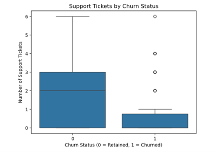
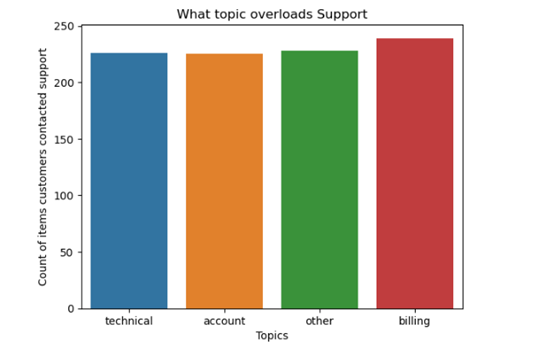
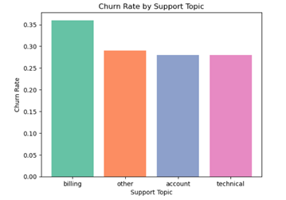
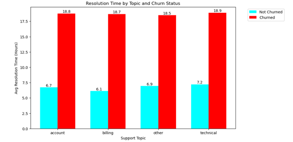
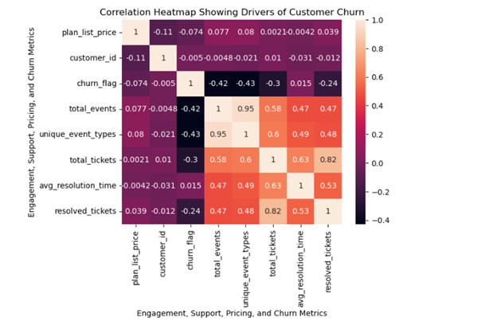

# Fit.ly-Tech-Subscribers-Churn-Analysis

Fit.ly Tech, a subscription-based fitness app in the United States with strong subscriber base across 50 differet states. The management noticed a significant churn rate creeping in Over the past two quarters, and they are interested to find out the cause and practical retention solutions. Retaining customers is absolutely critical for the company. Currently, the  cost of acquiring new users is rising, and every customer who leaves puts more pressure on Marketing and Product. Leadership has asked us to come back with a clear picture of what’s driving churn and some practical actions we can take heading into the next quarter.

## Data Validation and Cleaning

The analysis combined three datasets: account_info, customer_support and user_activity. Data cleaning was performed to correct inconsistencies before analysis.

1.	***Accounts_info Dataset***
   
*The table contained 400 rows, no duplicates. All rows were kept for analysis.*
- customer_id - original values contained a leading “C”, which was removed to align with user_id in other datasets, and the data type was converted to numeric for reliable joins.
- Email - No missing values or duplicates were detected.
- State-  No invalid or unexpected states found.
- Plan - Confirmed that all users were assigned a valid subscription plan, there was no missing or invalid plan values.
- plan_list_price – Converted from object and validated as numeric (int64).
- churn_status - Missing churn_status values were interpreted as “Not Churned”, and the column values were standardized to ensure consistency. A binary churn_flag column was created (1 = churned, 0 = retained).

2.	***Customer_Support Dataset***
   
*The table contained 918 row entries of customer support data, no duplicates.*
- ticket_time - Converted from string to datetime format.
- user_id - Validated as numeric and aligned with customer_id.
- Channel - Text standardized to lowercase and trimmed, and invalid or placeholder values were replaced with “unknown”.
- Topic - Reviewed for consistency; no unexpected categories found.
- resolution_time_hours- format Converted to numeric (float64), and invalid entries were coerced to null.
- State - Confirmed binary values (1 = resolved, 0 = unresolved). A descriptive column (Resolved / Unresolved) was created.
- Comments - High number of nulls; retained but excluded from quantitative analysis.

3.	***User Activity Dataset***
   
*The table contained 446 entry rows of subscribers' activities in their various plans and engagement behavior of the feautures of the fitness app.*
- event_time - Converted from string to datetime.
- user_id - Validated as numeric and aligned with account data.
- event_type - Confirmed four expected categories

4. ***Final_df Dataset**
- The table is a result of merged datasets to aid in the analysis of engagement, customer)support and use_activity to find patterns causing churn. Null values in numeric columns were replaced with 0s for data quality.

- [Here is the Code used for this analysis from Cleaning, to EDA to Visualization](FitlyCode.ipynb)

****DATA MODELLING****

## Exploratory Analysis & Visualizations

The analysis focused on engagement, support activity, and plan characteristics, as requested by leadership.

1. Overall Churn Distribution
   
•	Fig. 1 shows the proportion of churned vs retained customers. Churn rate in the last two quarters has grown to 28.5%.

   
2. Engagement Volume Distribution.

Engagement analysis shows a strong relationship between product usage and churn. Customers who churned were highly concentrated at very low engagement levels, while retained customers demonstrated broader and more sustained usage. This indicates that early engagement and successful product activation are critical drivers of retention.

Low-engagement users churn at a much higher rate 53.9% than highly engaged users, who are at 12.6%. Trying to engage customers will improve subscribers' retention rates.

3. Churn By Plans
   
The Free plan is more prone to churn, with a churn rate of 41%. Pro plan users have a lower rate of churning of 22.41%.  Combining the churn rates of basic, enterprise, and pro subscribers, this equates to 70% of paid subscribers who left in the last two quarters.

4. Churn By Location
   
Subscribers from New Jersey, Michigan, and Nebraska show disproportionately higher churn rates, which may indicate regional differences in user needs or marketing misalignment.

5. Support Load vs Churn (Box Plot)

Retained users actually contact support more frequently. Median tickets for retained users (0) is 2, while for churned users (1) is 0.
📌 This means:
- Churned users are NOT contacting support more often than retained users. Churned users mostly have zero or very few tickets, as seen, most churned users sit at 0–1 tickets. A few churned users have high ticket counts (outliers), but they are rare. This suggests that many churned users may be quiet churners; they leave without repeatedly reaching out for help.
On the other end, retained subscribers show a wider support interaction range. They have more tickets, a larger spread, and higher maximums. Retained users may experience issues, but stay because support eventually helps them

6. What Topics overload support

- The distribution of customer support tickets shows that billing-related issues are the most frequent reason subscribers contact support. This suggests that billing problems represent a critical friction point in the customer experience. While billing issues alone do not directly explain churn, unresolved or repeated billing problems are likely contributing to customer dissatisfaction and subsequent churn.
- Billing issues are the most frequent reason customers contact support and are a likely indirect driver of churn, especially when these issues experience long resolution times or repeat occurrences. The billing topic alone constitutes over 35% of the churn rate by topic.

- Upon closer analysis of the support load and response, it is evident that long hours of resolution are directly responsible for the high rate of churn across all topics. Customers churn primarily due to prolonged support resolution times, regardless of issue type, with churned users experiencing resolution delays nearly three times longer than retained customers. - Analysis of average support resolution times by topic and churn status reveals a consistent pattern across all issue types. Customers who churn experience average resolution times of approximately 18–19 hours, compared to 6–7 hours for retained customers. This suggests that prolonged resolution time, rather than the nature of the support issue itself, is a primary driver of churn. Improving response and resolution speed across all support channels, particularly for high-volume topics such as billing, represents a key opportunity to reduce churn.

7. Heatmap
   
Churned users typically engage with fewer product features. Retained users show broader feature adoption. 

- Low engagement is the strongest churn driver. The negative correlations between churn and engagement metrics indicate an inverse relationship: as user engagement increases, the likelihood of churn decreases. Specifically, the correlation between churn_flag and total_events is –0.42, while the correlation between churn_flag and unique_event_types is –0.43.
- These values suggest a moderate-to-strong negative relationship, meaning customers who use the product more frequently and explore a wider range of features are significantly less likely to cancel their subscriptions. In contrast, users with limited activity and narrow feature usage show a much higher propensity to churn.
- From a behavioral standpoint, this implies that habit formation and product value realization are critical to retention. Customers who engage across multiple features are more likely to integrate the product into their routines, increasing perceived value and switching costs. Conversely, low-engagement users may never fully experience the product’s benefits, making them more susceptible to churn when faced with pricing, friction, or competing alternatives. The company should consider selling strategies like cross-selling

## Key Findings

i.	Low engagement is the strongest driver of churn, particularly early in the customer lifecycle.
ii.	Long support resolution times significantly increase churn risk, regardless of issue type.
iii.	Billing-related issues are a major friction point and amplify churn when resolution is delayed
iv.	Many churned users are “silent churners” who leave without engaging support.
v.	Paid subscribers represent the largest churn volume, despite lower churn rates than free users.
vi.	Certain geographic regions exhibit systematically higher churn, indicating targeted intervention opportunities.

## Business Metric to Monitor

### Primary KPI

•	Average Support Resolution Time (Active Subscribers)
o	Current: ~18 hours for churned users
o	Target: ≤ 8 hours

### Secondary KPI

•	Percentage of Tickets Resolved Within Service Level Agreement (SLA)

### Operational Actions

•	Establish a Service Level Agreement (SLA) of ≤ 8 hours for support resolution.
•	Flag tickets exceeding 12 hours as high churn risk.
•	Prioritize billing-related tickets nearing Service Level Agreement (SLA) breach.
•	Trigger automated retention workflows for delayed resolutions

## Final Summary & Recommendations

### Summary

Churn at Fit.ly Tech is primarily driven by low product engagement and slow customer support resolution, rather than the volume of support issues or plan pricing alone. Customers who fail to activate meaningfully or experience prolonged friction, especially around billing, are significantly more likely to cancel. Retained customers, by contrast, engage more deeply with the product and interact with support successfully when issues arise.
Practical actions leadership can take
Fit.ly Tech should consider adopting the following practical solutions
i.	Set a resolution time target as a Service Level Agreement (SLA) to be below 8 hours. 
ii.	Flag tickets exceeding 12 hours as high-risk churn subscribers
iii.	Prioritize billing tickets nearing SLA breach
iv.	Trigger retention workflows when resolution time exceeds the threshold

### Recommendations

1.	Fit.ly Tech should introduce usage-based nudges to its plans and feature the products the platform offers to customers. Specifically, the company should adopt milestone & progress nudges to celebrate user achievements and encourage "habit loops." For the workouts and articles sections of the platform. This will enhance subscribers' engagement to maintain daily or weekly goal streaks, hence retention. Other nudges are re-engagement Nudges that trigger when a user's activity levels drop below a certain threshold to encourage engagement, and Value Reinforcement Nudges to remind users of the benefits they have already received. These nudges are imperative to enhance subscriber retention and reduce the surging churn rate in the long run.
2.	Fit.ly Tech should invest in faster resolution strategies and infrastructures, especially in billing and technical issues, and enforce SLAs and introduce escalation for delayed tickets.
3.	Fit.ly should start to proactively identify silent churn risks by flagging users with low engagement and no support contact, and use this to trigger retention outreach before cancellation.
4.	The product and marketing team should review marketing, onboarding, and messaging for states with elevated churn. 
5.	Prioritize engagement and support resources toward paid plans to reduce revenue impact, by crafting special customer support packages in paid plans to protect paid subscribers
